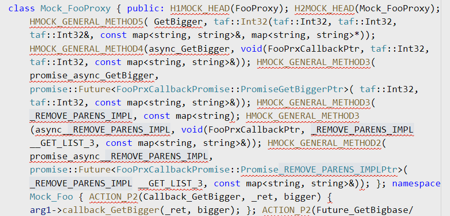

# 宏编程的艺术

> 2020/5/17
> 
> 可以言传者，物之粗也；可以意致者，物之精也。——《庄子·秋水》

## 写在前面 [no-toc]

> 之前写过几篇关于 C/C++ **宏** _(macro)_ 和 C++ **元编程** _(metaprogramming)_ 的文章：
> 
> - [令人头疼的 宏定义 污染](../2017/Macro-Pollution.md) 列举了两个 宏相关的 **坑**，并从 **绕开污染源/阻止污染扩散/缩小污染范围** 的角度 尝试解决
> - [浅谈 C++ 元编程](../2017/Cpp-Metaprogramming.md) 介绍了 **基于模板的元编程**
> - [简单的 C++ 结构体字段 反射](../2018/Cpp-Struct-Field-Reflection.md) 利用模板元编程（和极少的宏），实现 **非侵入式、声明式、零开销** 结构体 静态反射

C++ **模板元编程** _(template metaprogramming)_ 虽然功能强大，但也有 **局限性**：

- 不能通过 模板展开，生成新的 **标识符** _(identifier)_
  - 例如 生成新的 函数名、类名、名字空间名 等
  - 调用方 只能使用 提前定义的标识符
- 不能通过 模板参数，获取 **符号/标记** _(token)_ 的 **字面量** _(literal)_
  - 例如 在反射中获取 实参的参数名，在断言中获取 表达式的字面量
  - 调用方 需要传递 字符串参数

所以，在需要直接 **操作标识符** 的情况下，还需要借助 **宏** 实现 **预处理元编程**：

- 和 **编译时** _(compile-time)_ 的 **模板** 展开不同，**宏** 在编译前的 [**预处理** _(preprocess)_](https://en.cppreference.com/w/cpp/preprocessor) 阶段全部展开 —— 狭义上，编译器 不会处理 宏代码
- 通过 `#define`/`TOKEN1##TOKEN2`/`#TOKEN` 定义 **宏对象** _(object-like macro)_ 和 **宏函数** _(function-like macro)_，实现 [替换文本、拼接标识符、获取字面量](https://en.cppreference.com/w/cpp/preprocessor/replace)

最近需要在单元测试中，**自动生成** 一些调用 [gmock](https://github.com/google/googletest/blob/master/googlemock/README.md) 相关宏的代码。由于不能 **在模板中 调用宏函数**，所以只能使用 **宏编程**。🙃

趁热打铁，本文总结一些 宏 的用法和原理 🙄：

[TOC]

参考了几个主流的 **预处理库** _(preprocessor library)_：

- [BOOST_PP](https://github.com/boostorg/preprocessor)（[导读：Appendix A - An Introduction to Preprocessor Metaprogramming](https://www.boost.org/doc/libs/master/libs/preprocessor/doc/AppendixA-AnIntroductiontoPreprocessorMetaprogramming.html)）
- [GMOCK_PP](https://github.com/google/googletest/blob/master/googlemock/include/gmock/internal/gmock-pp.h)（类似 BOOST_PP 的精简版）
- [pfultz2/Cloak](https://github.com/pfultz2/Cloak)

## 如何调试

很多人会因为 “宏编程” 无法调试，而直接 “从入门到放弃” —— 因为一些 **拼写错误**，导致文本 **不能正确替换**，从而带来 **满屏的编译错误**，最后 **难以定位** 问题所在：

- 编译器 **只会告诉你** XXX 宏 展开结果里包含 **语法错误**
- 而 **不会告诉你** XXX 宏 具体展开成什么样子，**具体错在哪里**

实际上，由于宏代码会 在编译前全部展开，通常可以：

- 仅输出 预处理的展开结果
  - `gcc -E` 让编译器 在预处理结束后停止，不进行 编译、链接
  - `gcc -P` 屏蔽编译器 输出预处理结果的 [**行标记** _(linemarker)_](https://en.cppreference.com/w/cpp/preprocessor/line)，减少干扰
  - 由于输出结果没有格式化，建议先传给 clang-format 格式化一下，再输出到终端/控制台
- 屏蔽 不需要的头文件
  - 临时删掉无关的 `#include` 行
  - 避免过多 [引用展开](https://en.cppreference.com/w/cpp/preprocessor/include)，导致自己的宏代码 “被淹没”

于是，展开错误一目了然（很容易发现 `_REMOVE_PARENS_IMPL` 的展开错误）：



## 特殊符号

A **macro argument** is a nonempty sequence of:

- Preprocessing tokens other than commas or parentheses, and/or
- Preprocessing tokens surrounded by matched pairs of parentheses.

和模板元编程不一样，宏没有数据类型，输入和输出都是一组符号，只有文本替换，不涉及语法问题。

``` cpp
#define PP_COMMA() ,
#define PP_LPAREN() (
#define PP_RPAREN() )
#define PP_EMPTY()
```

## 数据结构

- 元组
  - `FOO(std::pair<long, long>)` 被认为是两个参数
  - `FOO((std::pair<int, int>))` 被认为是一个参数

``` cpp
#define PP_REMOVE_PARENS(...) PP_REMOVE_PARENS_IMPL __VA_ARGS__
#define PP_REMOVE_PARENS_IMPL(...) __VA_ARGS__
```

## 符号拼接

- PP_CAT 延迟拼接

## 数值计算

- 一般都有上限，如果超出则不会继续展开

## 条件判断

- PP_IF

### 符号匹配

- PP_IS_BEGIN_PARENS

### 符号匹配

- 检查是不是 `void`

## 空处理

- 宏函数支持 `__VA_ARGS__` 变长参数（0, 1, ... 个参数）
- `__VA_OPT__` 需要 C++ 20 支持
- `PP_COMMA_IF` 避免多余逗号

## 递归调用

``` cpp
// Bad
#define FOO(_1) (1 + FOO(_1))
#define BAR (1 + BAR)

// Bad
FOO(42)  // expanded into: (1 + FOO(42))
BAR      // expanded into: (1 + BAR)

// Good
FOO(FOO(42))  // expanded into: (1 + (1 + 42))
```

- https://gcc.gnu.org/onlinedocs/cpp/Self-Referential-Macros.html
- https://github.com/pfultz2/Cloak/wiki/C-Preprocessor-tricks,-tips,-and-idioms
- https://www.boost.org/doc/libs/master/libs/preprocessor/doc/topics/reentrancy.html

## 写在最后 [no-toc]

如果有什么问题，**欢迎交流**。😄

Delivered under MIT License &copy; 2020, BOT Man
